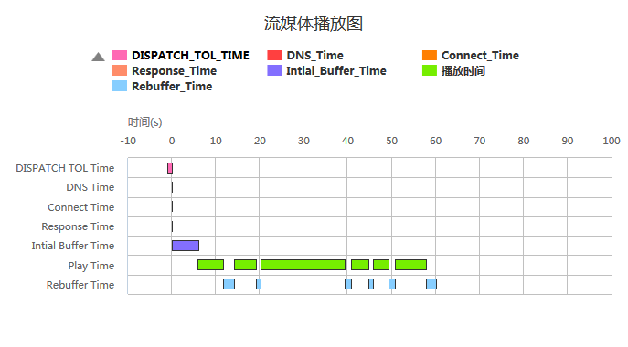

##2.1. 流媒体播放图
####1.data示例
```js
var data=[
    {name:"DISPATCH TOL Time",DISPATCH_TOL_TIME:1,start:-1},
    {name:"DNS Time",DNS_Time:0.010,start:0},
    {name:"Connect Time",Connect_Time:0.055,start:0},
    {name:"Response Time",Response_Time:0.074,start:0},
    {name:"Intial Buffer Time",Intial_Buffer_Time:6,start:0},
    {name:"Play Time",Play_Time:5.703,start:6},
    {name:"Rebuffer Time",Rebuffer_Time:2.500,start:11.703},
    {name:"Play Time",Play_Time:5.000,start:14.203},
    {name:"Rebuffer Time",Rebuffer_Time:1.000,start:19.203},
    {name:"Play Time",Play_Time:19.016,start:20.203},
    {name:"Rebuffer Time",Rebuffer_Time:1.515,start:39.219},
    {name:"Play Time",Play_Time:4.000,start:40.734},
    {name:"Rebuffer Time",Rebuffer_Time:1.000,start:44.734},
    {name:"Play Time",Play_Time:3.500,start:45.734},
    {name:"Rebuffer Time",Rebuffer_Time:1.500,start:49.234},
    {name:"Play Time",Play_Time:7.000 ,start:50.734},
    {name:"Rebuffer Time",Rebuffer_Time:2.266,start:57.734}
]
```
####2.option示例
```js
var option={
    containerId:"container",
    shows:["DISPATCH_TOL_TIME","DNS_Time","Connect_Time","Response_Time","Intial_Buffer_Time","Play_Time","Rebuffer_Time"],    //要显示的指标
    title:"流媒体播放图",        //标题
    yTitle:"时间",              //y轴标题（可选）
    yUnit:"s",                 //y轴单位（可选）
    startName:"start",         //开始时间
    xName:"name",              //x轴要显示的字段
    group:"name"               //分组依据
};
```

####3.例子


[查看示例](./brcharts/test/streamingchart.html)

