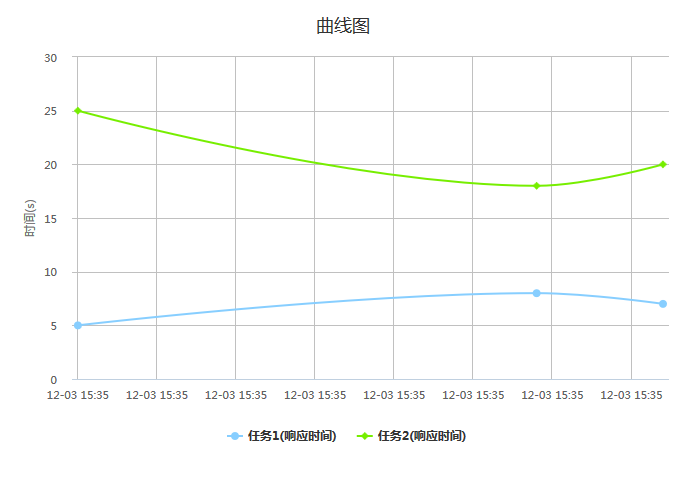

## 2.2. 曲线图
####1.data示例
```js
var data=[{"taskName":"任务1","响应时间":5,"datetime":"1417593120633"},
     {"taskName":"任务1","响应时间":8,"datetime":"1417593120633"},
     {"taskName":"任务1","响应时间":7,"datetime":"1418592120633"},
     {"taskName":"任务1","响应时间":6,"datetime":"1427592120733"}
];
```

####2.option示例
```js
var option={
    containerId:"container",          //放置HighCharts容器对应的ID
    shows:["响应时间","运行时间"],      //要显示的指标
    title:"曲线图",         //标题
    subtitle:"副标题",      //副标题
    yTitle:"时间",          //y轴标题
    yUnit:"s" ,             //y轴单位
    xName:"datetime"        //x轴显示的名称
};
```

####3.例子


[查看示例](./brcharts/test/splinechart.html)

