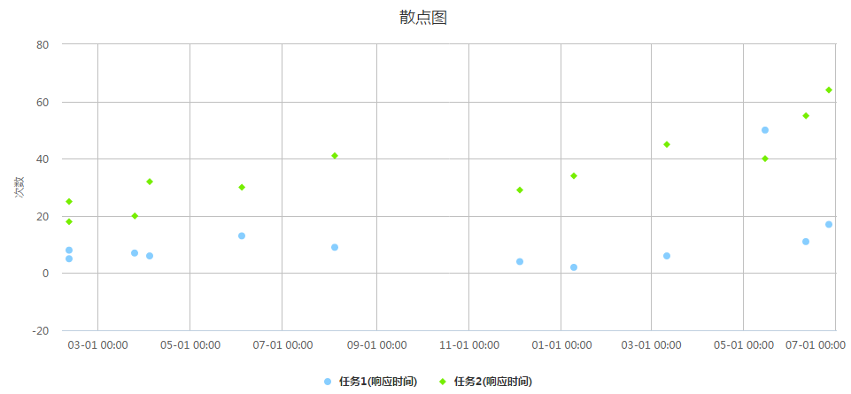

##2.4. 散点图
####1.data示例
```js
 var data=[{"datetime":"1360454400000","报警次数":23},
    {"datetime":"1370304000000","报警次数":15},
    {"datetime":"1389225600000","报警次数":18},
    {"datetime":"1400112000000","报警次数":45},
    {"datetime":"1403740800000","报警次数":39}
];
```

####2.option示例
```js
var option={
    containerId:"container",             //放置HighCharts容器对应的ID
    shows:["报警次数"],      //要显示的指标
    title:"散点图",          //标题
    subtitle:"副标题",       //副标题（可选）
    yTitle:"次数",           //y轴标题（可选）
    yUnit:"次" ,             //y轴单位（可选）
    xName:"datetime"         //x轴显示的名称
};
```

####3.例子


* [查看示例](./brcharts/test/scatterchart.html)
* [接口演示](./brcharts/test/scatterchart-all.html)

