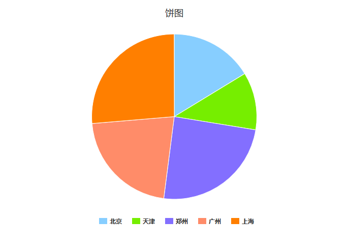

##2.5. 饼图
####1.data示例
```js
var data=[{"taskName":"任务1","城市":"北京","在线人数":520000,"报警次数":52000},
    {"taskName":"任务1","城市":"天津","在线人数":360000,"报警次数":36000},
    {"taskName":"任务1","城市":"郑州","在线人数":780000,"报警次数":78000},
    {"taskName":"任务1","城市":"广州","在线人数":690000,"报警次数":69000},
    {"taskName":"任务1","城市":"上海","在线人数":840000,"报警次数":84000}
];
```

####2.option示例
```js
var option={
    containerId: "container",    //放置HighCharts容器对应的ID
    shows:["在线人数"],         //要显示的指标
    title:"饼图",
    xName:"城市"
};
```

####3.例子


[查看示例](./brcharts/test/piechart.html)

