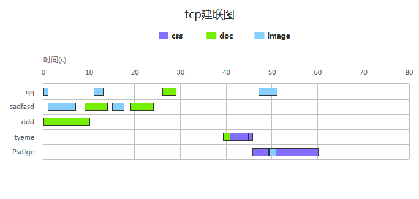

##2.8. TCP建联图
####1.data示例
```js
var data=[
    {url:"qq",time1:1,start:0,tcp:"11",time2:2,type:"image"},
    {url:"qq",time1:2,start:11,tcp:"11",time2:2,type:"image"},
    {url:"qq",time1:3,start:26,tcp:"11",time2:2,type:"doc"},
    {url:"qq",time1:4,start:47,tcp:"11",time2:2,type:"image"},
    {url:"sadfasd",time1:6,start:1,tcp:"12",time2:2,type:"image"},
];
```

####2.option示例
```js
var option={
    containerId:"container",
    shows:["time1"],            //要显示的指标
    title:"tcp建联图",          //标题
    yTitle:"时间",              //y轴标题
    yUnit:"s",                  //y轴单位
    startName:"start",          //起始时间字段
    group:"tcp",                //分组
    xName:"url",                //x轴显示的名
    dimension:"type"            //维度
};
```

####3.例子


[查看示例](./brcharts/test/tcpchart.html)

